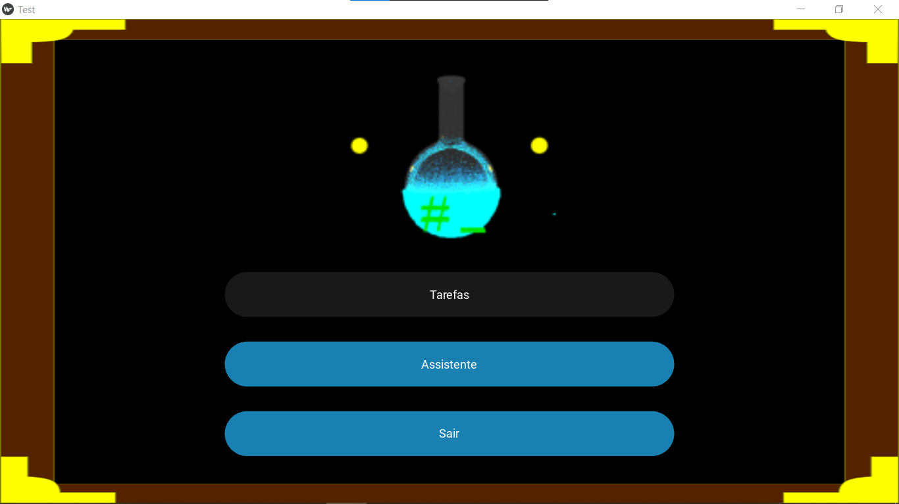
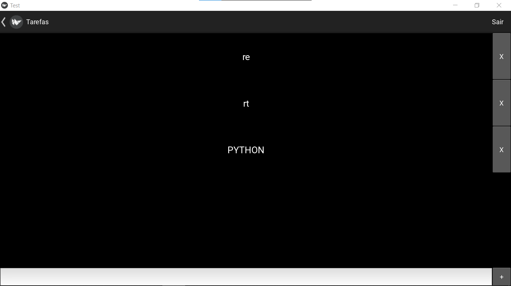
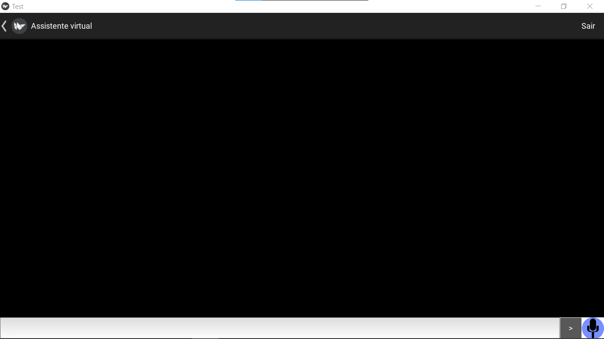
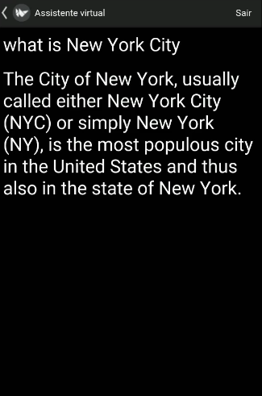

# CHATBOT WIKI COM KIVY
👨‍🏫PROJETO CRIADO PARA O CURSO KIVY.

 <br>
 <br>
 <br>
 <br>

## DESCRIÇÃO:
Este projeto é um aplicativo de assistente virtual com interface gráfica, desenvolvido usando Kivy. O assistente é capaz de responder a perguntas e realizar algumas ações básicas. O aplicativo inclui uma funcionalidade de chatbot que pode ouvir comandos de voz, processar texto e falar as respostas.

## FUNCIONALIDADES:
1. **Interface Gráfica com Kivy**:
   - **Menus e Navegação**: A aplicação possui várias telas, incluindo um menu principal e telas de tarefas.
   - **Botões Personalizados**: Botões personalizados que mudam de cor ao serem pressionados.

2. **Gerenciamento de Tarefas**:
   - **Adicionar Tarefas**: Possibilidade de adicionar novas tarefas.
   - **Remover Tarefas**: Possibilidade de remover tarefas existentes.
   - **Salvar e Carregar Tarefas**: As tarefas são salvas em um arquivo JSON e carregadas ao iniciar a aplicação.

3. **Assistente Virtual**:
   - **Chatbot**: Um chatbot que responde a perguntas de texto.
   - **Síntese de Voz**: Utiliza a biblioteca `plyer` para falar as respostas.
   - **Reconhecimento de Voz**: Utiliza a biblioteca `plyer` para ouvir e processar comandos de voz.

## EXECUTANDO O PROJETO:
1. **Instale as Dependências**:
   - Vá até `./CODIGO` e digite o seguinte comando no Terminal/CMD:
   ```sh
   pip install -r requirements.txt
   ```

2. **Execute o Script Principal**:

   ```sh
   python main.py
   ```

3. **Menu Principal**:
   - Ao iniciar o aplicativo, você será levado ao menu principal.
   - O menu principal permite navegar para outras telas, como a de gerenciamento de tarefas e o assistente virtual.

4. **Gerenciamento de Tarefas**:
   - Adicionar uma nova tarefa digitando no campo de texto e clicando no botão de adicionar.
   - Remover uma tarefa clicando na tarefa que deseja remover.

5. **Assistente Virtual**:
   - Digitar uma mensagem na caixa de texto e pressionar enter para enviar ao chatbot.
   - O chatbot responderá com uma mensagem de texto.
   - Clique no ícone de microfone para iniciar o reconhecimento de voz. Fale o comando e o assistente processará e responderá.
   - A resposta do assistente será falada usando síntese de voz.

## CREDITOS:
- [PROJETO FEITO PELO VILHALVA](https://github.com/VILHALVA)
- [PROJETO CRIADO PARA O CURSO KIVY](https://github.com/VILHALVA/CURSO-DE-KIVY)


